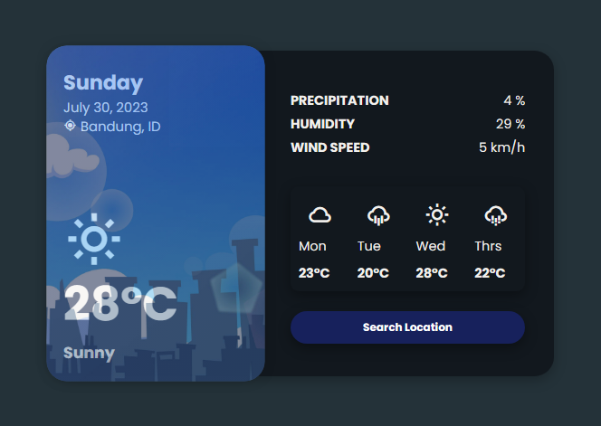
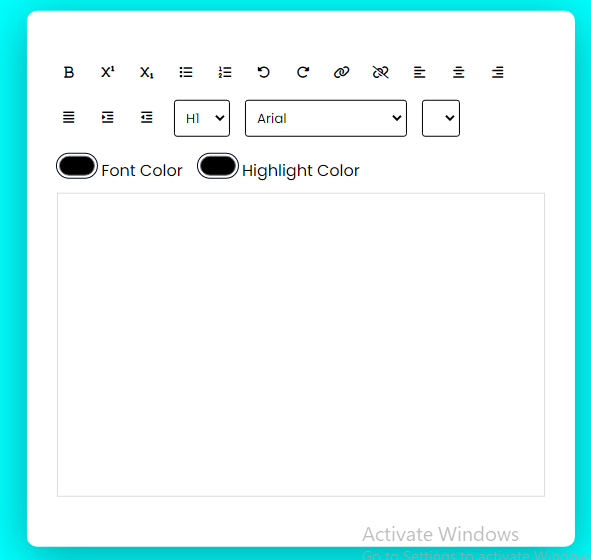
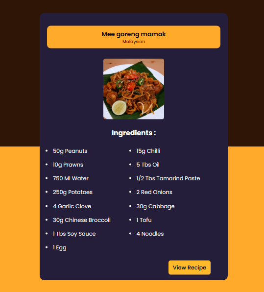

# 100 Days Coding Challenge

### Day #1 - Weather UI | Daily Coding Challenge

I learn Front end tutorial from YouTube

## Screenshot

Here is the screenshot :

<!-- ------------------------------------- -->

### Day #2 - Simple Text Editor | Daily coding challenge

## Screenshot

Here is the screenshot :

<!-- -------------------------------------- -->

### Day 3 - Receipt app | Daily coding challenge

we use API to search meal by name : https://www.themealdb.com/api.php

Here is the screenshot :

<!-- ----------------------------------- -->
